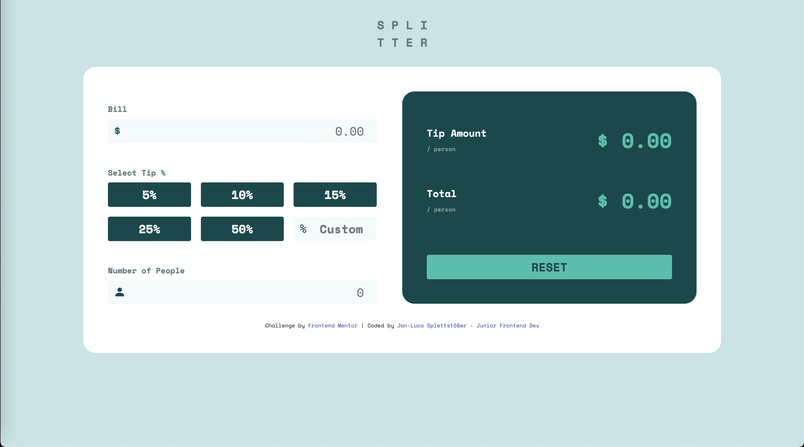

# Frontend Mentor - Tip calculator app solution

This is a solution to the [Tip calculator app challenge on Frontend Mentor](https://www.frontendmentor.io/challenges/tip-calculator-app-ugJNGbJUX). Frontend Mentor challenges help you improve your coding skills by building realistic projects.

## Table of contents

- [Overview](#overview)
  - [The challenge](#the-challenge)
  - [Screenshot](#screenshot)
  - [Links](#links)
- [My process](#my-process)
  - [Built with](#built-with)
  - [What I learned](#what-i-learned)
  - [Continued development](#continued-development)
- [Author](#author)

## Overview

### The challenge

Users should be able to:

- View the optimal layout for the app depending on their device's screen size
- See hover states for all interactive elements on the page
- Calculate the correct tip and total cost of the bill per person

### Screenshot

### Links

- Solution URL: [Go To Repo](https://github.com/lucaspl3tti/tip-calculator-app/)
- Live Site URL: [Go to Live Site](http://tip-calculator.spletti.info/)

## My process

### Built with

- Semantic HTML5 markup
- Bootstrap 5
- Flexbox
- Mobile-first workflow
- JavaScript
- SCSS
- Webpack

### What I learned

How to set up webpack and npm for local development

### Continued development

Project Structure

### Useful resources

## Author

- Website - [Jan-Luca Splettstößer](https://www.spletti.info)
- Frontend Mentor - [@lucaspl3tti](https://www.frontendmentor.io/profile/lucaspl3tti)
